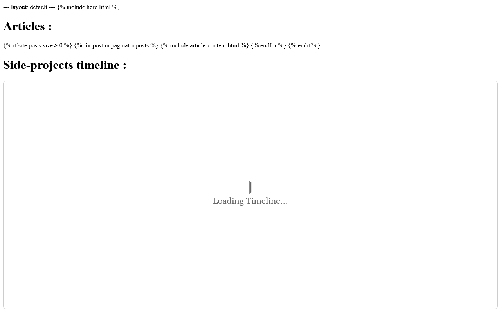

# 3D Models View

Web viewer for 3D models by Aris Hadisopiyan — browse and inspect assets in-browser.



**Live demo:** [https://rogue-dev-studio.github.io/Arishadisopiyan3DModelsView/](https://rogue-dev-studio.github.io/Arishadisopiyan3DModelsView/)

## Highlights
- Model gallery / viewer
- WebXR sandbox extras in-repo

## Run
Open `index.html` locally (Live Server on port **5500**), or use the live demo above.

```bash
git clone https://github.com/rogue-dev-studio/Arishadisopiyan3DModelsView.git
```

By [Aris Hadisopiyan](https://rogue-dev-studio.github.io/) / Rogue Dev Studio.

MIT
